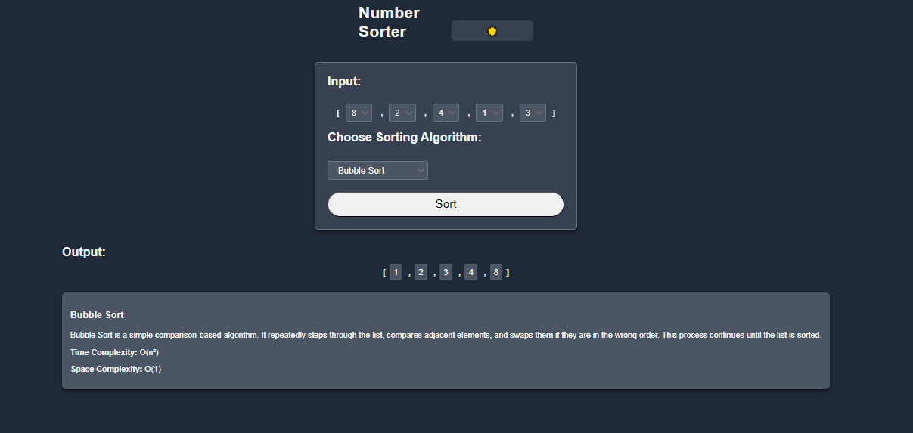

# Number Sorter


## Demo: https://mduduzindlovu-dev.github.io/number-sorter/
## Overview

Number Sorter is a web application that allows users to input an array of numbers and sort them using various sorting algorithms. The user can choose between different sorting algorithms such as Bubble Sort, Selection Sort, and Insertion Sort. After the sorting operation, the sorted array is displayed on the UI.

Additionally, the app features a dark mode toggle for enhanced user experience.

## Features

- **Multiple Sorting Algorithms**: Users can choose from Bubble Sort, Selection Sort, or Insertion Sort.
- **Interactive UI**: Input values are provided as dropdowns, and the sorted output is displayed dynamically.
- **Dark Mode**: Toggle between light and dark modes.
- **Responsiveness**: The application is responsive, adapting to various screen sizes.

## Technologies Used

- **HTML**: Structure of the webpage.
- **CSS**: Styling and design, with support for dark mode.
- **JavaScript**: Implements the sorting algorithms, UI updates, and dark mode functionality.

## How to Use

1. Select the numbers to be sorted from the dropdown lists under the "Input" section.
2. Choose the sorting algorithm you would like to use from the dropdown labeled "Choose Sorting Algorithm".
3. Click the "Sort" button to sort the numbers.
4. The sorted array will be displayed below in the "Output" section.

### Dark Mode

Click the 🌙/☀️ button in the top-right corner to toggle between light and dark modes. The app remembers your theme preference across sessions.

## Setup Instructions

### 1. Clone the repository:

```bash
git clone <repository_url>
